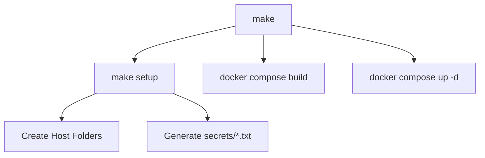

# Developer Documentation

This document describes the technical architecture, development workflows, and storage configurations of the Inception stack.

## 1. Environment Setup & Prerequisites

### Minimum Requirements:
- **Operating System**: A Linux Virtual Machine (Debian 11 recommended).
- **Packages**: `docker.io`, `docker-compose-plugin`, `make`, `sudo`.
- **System Privileges**: User should be in the `docker` sudo group to run commands without `sudo` prompting.

### Project Structure & Configurations:
- **Root level**: Contains `Makefile`, `.gitignore`, and the `secrets/` directory.
- **`srcs/` level**:
  - `.env`: Holds non-secret environment variables (site titles, database username, domain name, email address).
  - `docker-compose.yml`: Declares services, bridge network, named volumes and mounts Docker secrets.
- **`srcs/requirements/<service>/` level**:
  - `Dockerfile`: Multi-stage or simple builds inheriting from `debian:bullseye`.
  - `conf/`: Service-specific configurations (Nginx server block, MariaDB bind config, PHP-FPM www pool config).
  - `tools/`: Initialization scripts.

---

## 2. Build and Launch the Project

The project is driven by a Makefile.



### Build Flow:
1. Run `make` to execute the default target `up`.
2. It triggers the `setup` target, which runs:
   - `mkdir -p /home/liyu-her/data/wordpress`
   - `mkdir -p /home/liyu-her/data/mariadb`
   - Generates default credentials under `./secrets/` if they are not already present.
3. Builds the Docker files locally (`docker compose up --build`).

---

## 3. Useful Commands for Development

Developers can use standard Docker Compose commands to inspect and interact with the stack.

### Shell Access into Containers:
- **Nginx**:
  ```bash
  docker exec -it nginx /bin/bash
  ```
- **WordPress**:
  ```bash
  docker exec -it wordpress /bin/bash
  ```
- **MariaDB**:
  ```bash
  docker exec -it mariadb /bin/bash
  ```

### Inspect Volumes and Networks:
- **List Volumes**: `docker volume ls`
- **Inspect Inception Network**: `docker network inspect inception_net`

### Force Rebuilding Single Service:
If you make changes to a configuration or setup script, you can rebuild only that container:
```bash
docker compose -f srcs/docker-compose.yml build <service_name>
docker compose -f srcs/docker-compose.yml up -d --no-deps <service_name>
```

---

## 4. Persistent Storage & Volumes Configuration

Data persistence is managed via named volumes with local drivers binding to specific paths on the host's filesystem.

### Volume Mappings:
| Service | Container Path | Host Path | Description |
| :--- | :--- | :--- | :--- |
| **MariaDB** | `/var/lib/mysql` | `/home/liyu-her/data/mariadb` | Stores binary database log records, tables, and tablespace files. |
| **WordPress** | `/var/www/html` | `/home/liyu-her/data/wordpress` | Stores WordPress source files, themes, plugins, and uploaded assets. |

Both paths map to `/home/liyu-her/data/` inside the Virtual Machine. The local driver with `bind` and `o: bind` options ensures that files written inside the container are instantly written to the host and remain after container termination.
